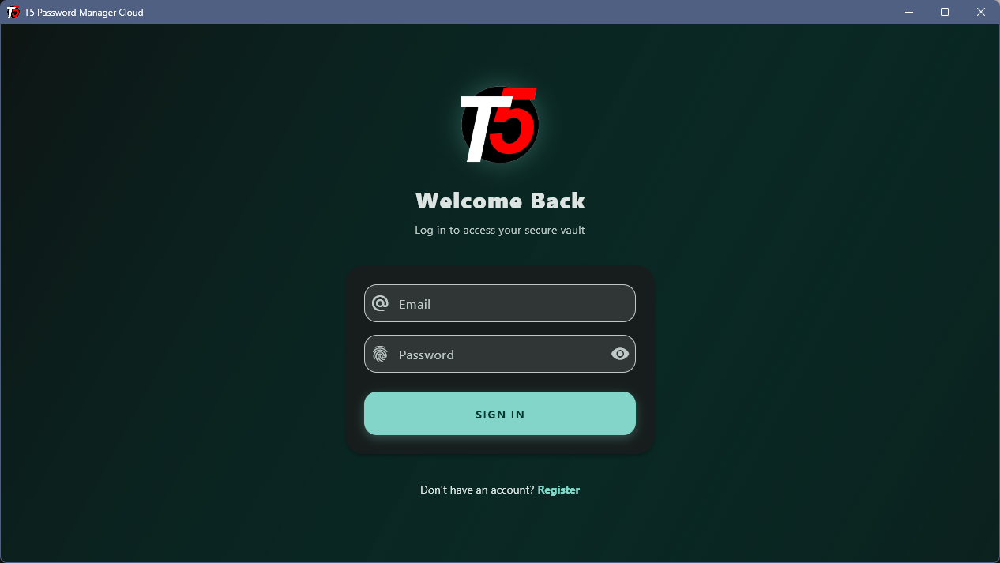
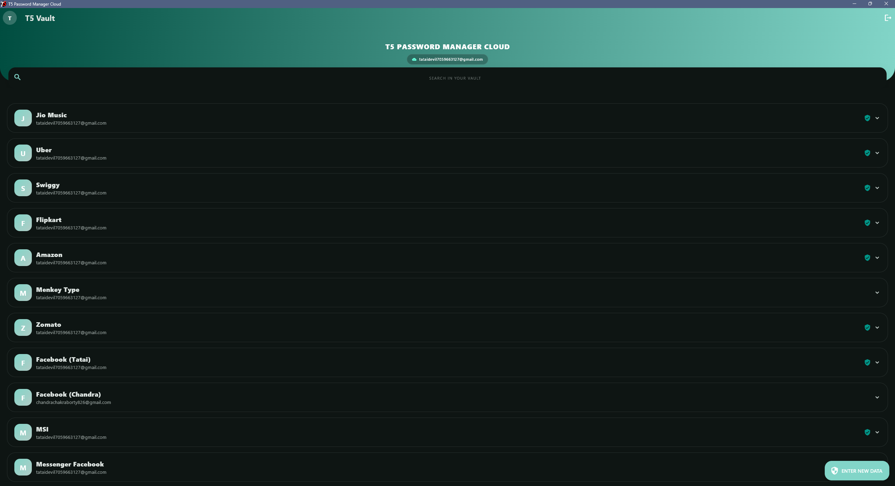
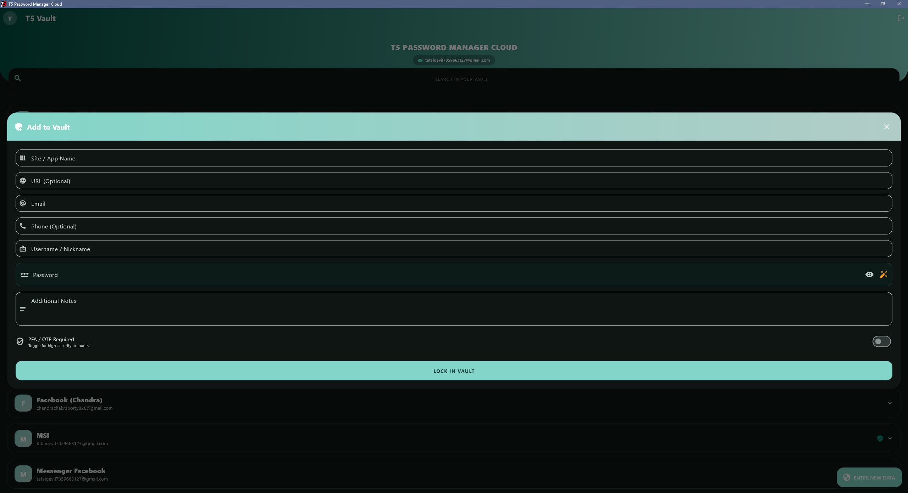
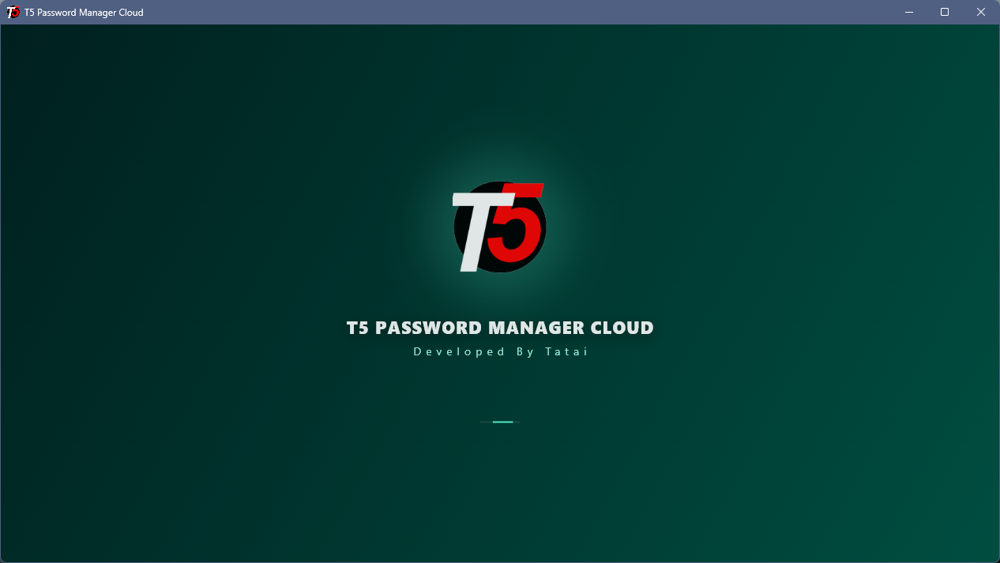
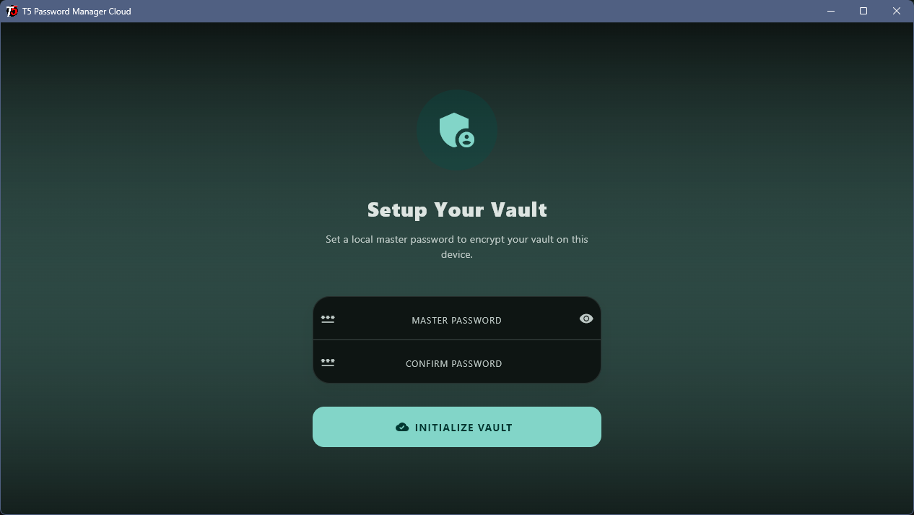
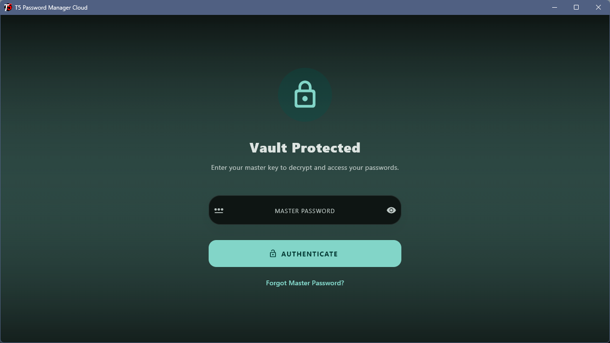
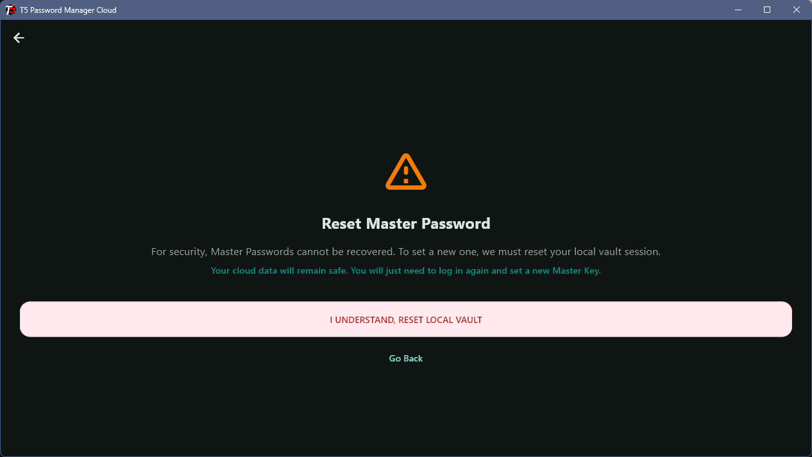

<div align="center">

  

  # T5 Password Manager - Windows 💻

  *Secure, lightweight, and intuitive credential management for your Windows desktop.*

  [](https://www.microsoft.com/windows)
  []()
  [](https://opensource.org/licenses/MIT)
  [](http://makeapullrequest.com)

  <br><br>

  <a href="https://github.com/Tatai47/T5-Password-Manager-Cloud-For-Windows/raw/refs/heads/main/T5%20Password%20Manager%20Cloud%20Windows.zip">
    
  </a>

</div>

<br>

> **T5 Password Manager** brings secure and efficient credential management to your Windows desktop. Built for performance and reliability, it ensures your sensitive data is always protected and easily accessible when you need it.

---

## ✨ Key Features

* 🔐 **Bank-Grade Encryption:** Local AES-256 encryption ensures your vault is impenetrable.
* ⚡ **Fully Safe by T5:** This app is totally maintained by T5, so your data is safe here.
* 👆 **Master Password Protection:** A single, secure key to unlock your entire vault.
* 🎲 **Smart Password Generator:** Create strong, complex, and unique passwords on the fly.
* 📴 **Offline-First Architecture:** Your data never leaves your device unless you explicitly enable sync.

---

## 📸 Screenshots

| Login Screen | Password Vault | Data Entry |
| :---: | :---: | :---: |
|  |  |  |
| Loading Screen | Create Password Vault | Vault Login |
|  |  |  | 
| Reset Vault |

---

*(Note: Just drop your images into the `images/` folder in your repository to make these appear!)*

---

## 🛠 Tech Stack

This project is built using modern desktop development practices:

* **Language:** Flutter / (Dart) 
* **UI:** Flutter
* **Architecture:** MVVM (Model-View-ViewModel)
* **Storage:** Firebase / Local Encrypted Storage
* **State Management:** Provider / Riverpod / GetX *(Update as needed)*

---

## 🚀 Getting Started

### Prerequisites
* Windows 10 or Windows 11.
* [Visual Studio 2026](https://visualstudio.microsoft.com/downloads/) with the "Desktop development with C++" workload installed (Required for Flutter Windows builds).
* Flutter SDK installed on your machine.

### Installation for Developers

1. **Clone the repository:**
   ```bash
   git clone https://github.com/Tatai47/T5-Password-Manager-Cloud-For-Windows.git
